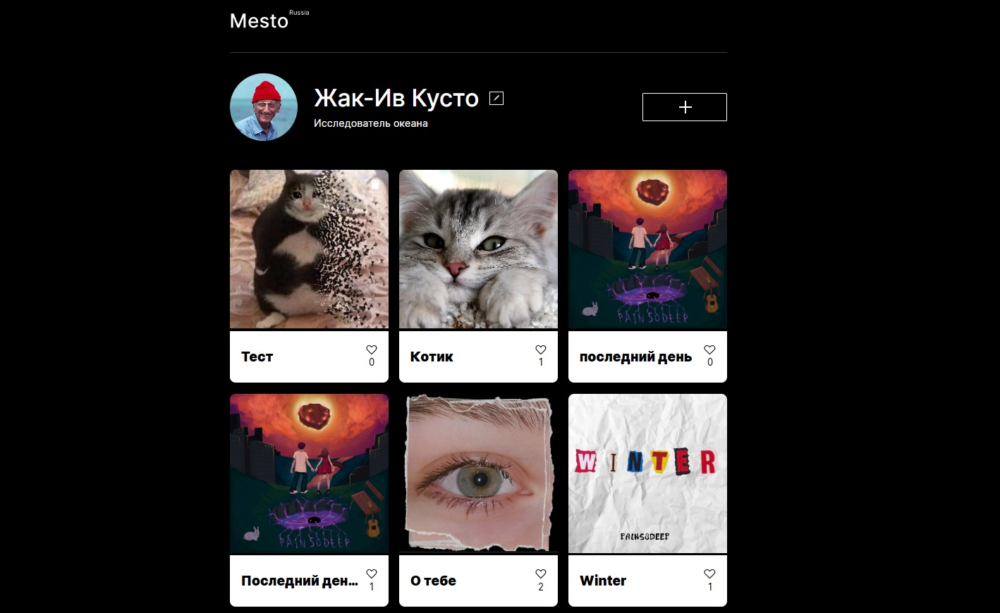

https://github.com/Ars2805/mesto-project
# Яндекс Практикум, проектная работа "Mesto"

## Оглавление

- [Live](#live)
- [Запуск](#запуск)
- [Скриншоты](#скриншоты)
- [Описание](#описание)
- [Автор](#автор)

### Live
https://ars2805.github.io/mesto-project/

### Запуск

```
git pull https://ars2805.github.io/mesto-project.git
cd mesto-project
npm i
npm run dev
```

### Скриншоты




### Описание

Интерактивная страница, куда можно добавлять фотографии, удалять их и ставить лайки.

Использованные технологии: Webpack.

## Автор

- Github - [Арсения Лушина](https://github.com/Ars2805)
